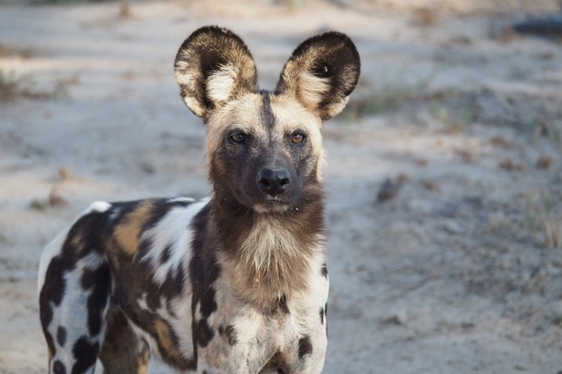

## African Wild Dog

One of the coolest African wild dog facts is that they are the most efficient hunters of any large predator, and succeed at a rate of over 80%. The African wild dog, also known as the Cape hunting dog, and African painted dog, is a large, intelligent, canine with a complex social life similar to a wolf.

On the hot plains and grasslands of Africa, wild dogs live in tight-knit packs of 20 to 40 animals, the members of which remain so for their entire lives, Often confused with hyenas and having a bit of a reputation.

African wild dogs regularly appear on peoples least-liked animals list. This page however, is unashamedly partial and will attempt to gain favor upon these fabulous fellows whose intense social drives echo back to the first four paws to ever recline beside us in dark caves of centuries past.

Wild dogs are achingly social, playful, and full of mischief and raw energy. They are constantly on the move, rarely staying in one location for more than a day or two, and this need for roaming space has contributed to their critical status in the wild.

There are no preserves large enough to comfortably contain a pack of African wild dogs, and when they stray out onto farmlands and roadways, they fall prey to car bumpers and farmers bullets.

The African wild dog is the second largest canine in the world, with the northern grey wolf being much heavier, but not neccessarily taller.

These dogs make lots of eerie noises and their habits of grinning and bowing to one another to show submission and friendship is perceived as skulking, and kind of creepy to many observers.

The most unfortunate habit wild dogs have is their hunting style, or rather their killing style. As opposed to using a choke hold or a kill bite like most predators,  African wild dogs will -as a group- grab a piece of their victim and basically tear it apart.

This is an absolutely horrific sight, but actually may be a shorter death for the hapless victim.

# The African Wild Dog Power Pack
The African wild dogs intensely close pack structure is its greatest strength, making the pack a force to be reckoned with.

Wild dogs are the most efficient hunters in Africa. They are successful  80% of the time in bringing down antelope, pig, and massive prey such as zebra and wildebeast that may easily be 10 times the size of an individual dog. 
 
After the hunt, the meal is freely distributed to pups, the nursing mom, and the sick, old or injured.

Although they make a tremendous amount of noise and may scream and squabble,  African wild dogs are rarely aggressive with each other. In fact, it is often a race to submission rather than dominance, with each dog giving the other a wide-lipped grin, bowing their heads low and "ha- ha" or "huffing" in reverance.

The wild dog pack is extremely tight-knit and works as a big, well-oiled machine because of this harmony.

They build up each others confidence with group "rallies" where they trot about shoulder to shoulder, tails held high, jostling and mouthing each other, definitely similar to wolves, but also to football players before the big game.

With the right numbers on their side, they will take on some of the largest land predators in the world, including hyenas and African lions, surrounding and tormenting their foe with a circle of grimacing determination.

Wild dogs don't generally kill these big adversaries, although there are accounts of them doing so.

Usually though, the plan is just to gain whatever the larger animal had in its possesion, or drive it from their territory.

# African Wild Dog Reproduction
Within the pack generally only the dominant male and female, called the Alpha pair, will reproduce.

After a  six week pregnancy the Alpha female will find a safe place, often an abandoned aardvark den, where she may deliver up to 20 puppies in a single litter - the most in the canine kingdom!

More commonly about 10 puppies are born. The entire pack helps in the rearing of this one litter. In the world of wild dogs it is the submissive animal who can most fervently beg that tends to eat first.

Food is distributed to the youngest pack members and sometimes the Alpha pair are actually be the last dogs to eat. The pack will settle down for several weeks while the pups are growing, going out to hunt twice a day and bringing food back in thier bellies which they will regurgitate for the mother and pups to eat.

At some point, however, in a strange twist, the mother will join in the hunts - being the Alpha female with lots of experience- and several designated "babysitters, usually males, will stay behind.

Because the entire pack contributes to the raising of one large litter of puppies a year, African wild dog puppies catch on quick, and may be seen out hunting with the pack by the time they are 6 months old.

